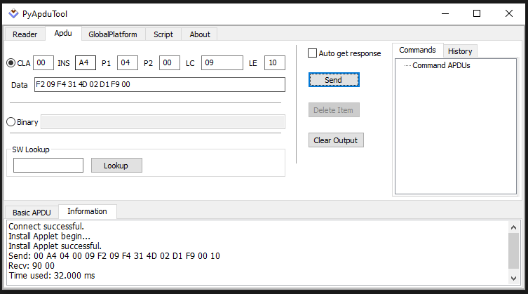
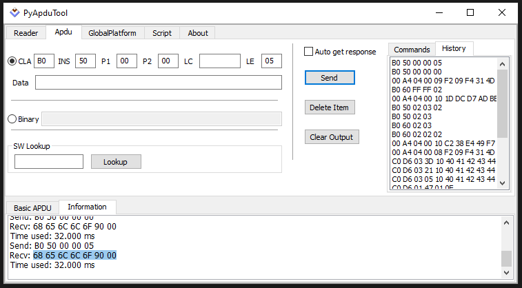
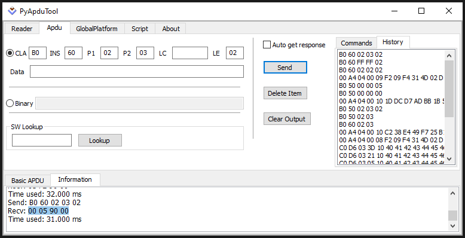

# Java Card Lab

## Выбор апплета

Перед отправкой APDU комманд необходимо выбрать нужный апплет. Для выбора апплета нужно знать его AID. Узнать AID можно выбрав скомпилированный CAP файл на вкладке Global Platform->Manager

Команда выбора апплета

| CLA | INS | P1 | P2 | LE |
|----------|:--------:|---------:|---------:|---------:|
| 00 | A4 | 04 | 00 | 10 |

В поле Data вписать AID

Вывод: 90 00

## Команды Hello World

### Сказать Hello

| CLA | INS | P1 | P2 | LE |
|----------|:--------:|---------:|---------:|---------:|
| B0 | 50 | 00 | 00 | 05 |

Вывод: 68 65 6C 6C 6F 90 00

### Сумматор двух чисел

| CLA | INS | P1 | P2 | LE |
|----------|:--------:|---------:|---------:|---------:|
| B0 | 60 | 02 | 03 | 02 |

Где P1 - первое число для суммирования, P2 - второе

Вывод: 00 05 90 00

